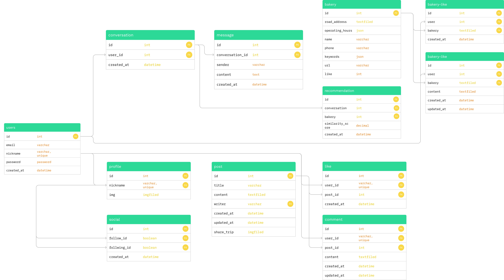

# 🥐 TRIPSNAP – 시간 효율 최적화 기반 맞춤형 대전 빵집 빵지순례 추천 시스템

**Team PAPAPAK**

---

## 📌 프로젝트 개요

TRIPSNAP은 사용자가 일일이 빵집 정보를 검색하지 않아도,  
사용자의 **위치 / 방문 시간 / 이동수단 / 취향 키워드**를 종합적으로 반영하여  
**최적의 빵집 방문 루트(빵지순례)를 자동 추천하는 AI 서비스**입니다.

- 단순한 빵집 추천이 아닌  
  → `맞춤형 추천 + 이동 동선 최적화 + 시간 효율`  
  을 동시에 해결하는 대전 지역 특화 빵지순례 플랫폼입니다.

---

## 🎯 프로젝트 목표

- ✔ 사용자의 빵집 탐색 시간·노력 최소화
- ✔ 개인 취향 기반 맞춤형 빵집 추천 제공
- ✔ 이동 동선, 영업 여부, 대기 시간까지 반영한 “실제 방문 가능한” 루트 생성
- ✔ 커뮤니티 활동 데이터 기반, 학습되는 추천 시스템 구현
- ✔ LLM + Vector DB + 딥러닝 키워드 모델을 활용한 고품질 추천 경험 제공

---

## 🧁 주요 기능 (Core Features)

### 1️⃣ 빵지순례 루트 자동 추천

- 입력: 위치 / 이동수단 / 방문 시간 / 키워드
- 도보·대중교통을 고려한 동선 기반 추천
- 영업 중인 매장만 필터링
- 방문 순서·루트를 함께 제시

### 2️⃣ 개인 맞춤형 추천 (커뮤니티 기반)

- 사용자의 커뮤니티 글에서 빵 관련 키워드 자동 추출
- “소금빵”, “크루와상”, “버터 풍미”, “쫀득한 식감” 등 취향 요소 벡터화
- 메인 화면에 개인 맞춤형 빵집 자동 추천

### 3️⃣ LLM 기반 챗봇 인터페이스

- 자연어로 조건을 자유롭게 입력
- 복합 조건(기간, 시간대, 이동수단, 메뉴 등) 자동 해석
- 추천 근거·이유를 LLM이 설명

### 4️⃣ 커뮤니티 기능

- 추천 받은 빵집을 게시글로 공유
- 좋아요 / 댓글 / 스크랩
- 본인의 빵 취향 히스토리 확장

---

## 🏗 시스템 아키텍처

### 🔧 기술 스택

| 영역        | 기술                                            |
| ----------- | ----------------------------------------------- |
| Frontend    | Vue3                                            |
| Backend     | Django REST Framework                           |
| DB          | RDB (PostgreSQL/MySQL 등) + Chroma 등 Vector DB |
| AI / LLM    | OpenAI API + RAG 구조                           |
| NLP         | KoELECTRA 기반 키워드 추출 모델                 |
| 지도        | Kakao Map API                                   |
| 데이터 수집 | Naver Place / Kakao Map / 블로그 크롤링         |

### 🔁 전체 흐름 개요

1. 사용자가 웹 프론트(Vue3)에서 챗봇/검색/커뮤니티 이용
2. Django REST API 서버가 요청 처리
3. 빵집·리뷰·유저 데이터는 RDB에서 조회
4. 의미 기반 검색은 Vector DB(Chroma)에 질의
5. LLM이 Vector DB 검색 결과 + 규칙 기반 로직을 바탕으로 추천을 생성
6. 결과를 구조화된 형태(카드, 리스트, 루트 정보)로 FE에 반환

---

## 🧬 데이터 파이프라인

1️⃣ **데이터 수집**

- Naver Place, Kakao Map, 블로그 등에서 빵집/카페 데이터 수집
- 매장 기본 정보 + 리뷰 텍스트 + 평점 + 위치 + 영업시간

2️⃣ **데이터 정제**

- 중복 매장 제거
- 노이즈 리뷰/광고성 텍스트 정리
- 주소·위치 좌표 정규화

3️⃣ **리뷰 분석 및 평점 통합**

- 리뷰 텍스트 → 감성 분석 / 평점 변환
- Kakao 평점 + 리뷰 기반 평점 → 가중치 통합

4️⃣ **키워드 추출**

- KoELECTRA 기반 키워드 분류 모델로 빵/맛/분위기/웨이팅 등 주요 키워드 태깅

5️⃣ **임베딩 & Vector DB 저장**

- 정제된 최종 데이터(jhgan/ko-sroberta-multitask 등 모델로 임베딩)
- Vector DB에 저장해 RAG 기반 추천에 활용

---

## 🤖 키워드 추출 딥러닝 모델

- **모델**: KoELECTRA 기반 커스텀 파인튜닝
- **입력**: Naver 리뷰, 블로그 리뷰 등 자연어 텍스트
- **출력**: 빵 관련 단어 및 카테고리 키워드
  - 메뉴: 소금빵, 크루와상, 식빵, 케이크 등
  - 맛 표현: 버터 풍미, 쫀득한, 촉촉한, 담백한 등
  - 분위기: 감성 카페, 넓은 좌석, 조용한 등
  - 웨이팅: 줄 서는, 웨이팅 필수, 인기 많은 등

예시:

```text
"버터 향이 진하고 결이 살아있는 크루와상, 웨이팅 있어도 먹을만해요"
→ ["크루와상", "버터 풍미", "식감 좋음", "웨이팅"]
```

- 해당 키워드들은:

1. 개인 취향 프로필 생성
2. 추천 점수 계산에 반영
3. LLM 프롬프트로 전달되어 설명 생성에도 활용

## 🧠 추천 알고리즘 개요

### 입력 요소

- 사용자의 자연어 요청
- 위치 정보(좌표 / 행정구역)
- 이동수단(도보 / 대중교통)
- 방문 가능 시간대(지금 / 특정 날짜 범위)
- 메뉴·맛 관련 키워드
- 평점 / 인기 / 리뷰 수
- 개인 취향 벡터(커뮤니티 활동 기반)

### 처리 흐름

1. 위치 기준 1차 필터링
2. 영업 시간 / 요일 / 현재 시간 기준 방문 가능 매장만 남김
3. 이동수단(도보/대중교통)에 따라 허용 거리/시간 필터링
4. 키워드 매칭 점수 계산 (메뉴, 맛, 분위기 등)
5. 평점 + 인기(리뷰 수) + 키워드 점수 + 개인 취향 점수 가중 합산
6. 간단한 경로 최적화(동선 상 가까운 순서)로 방문 순서 산출
7. Top-N 매장 + 방문 루트 반환

### 🧾 LLM + RAG 구조

#### 역할 분리

- Vector DB:
  - “어떤 빵집이 후보가 될 수 있는가?”를 찾음
- LLM:

  - 사용자의 자연어 의도 해석
  - 추천 결과를 설명형 문장으로 생성
  - 조건(시간, 대기, 이동수단 등)을 언어적으로 풀어 사용자에게 전달

- RAG 처리 흐름
  사용자 질문  
   → (임베딩) → Vector DB에서 유사도 높은 빵집/리뷰 검색  
   → 검색 결과 + 사용자 조건을 기반으로 LLM 프롬프트 구성  
   → LLM이 최종 답변/추천 코스 생성

#### 장점

- 단순 규칙 기반 추천이 아닌 “근거 있는 추천”
- 최신 데이터에 대한 확장 용이
- 모델이 임의로 지어내기(Hallucination) 위험 감소

## 🗄 ERD 개요 (Database Modeling)

본 프로젝트에서는 **관계형 DB(RDB)**와 Vector DB를 함께 사용합니다.

### 1️⃣ 주요 엔터티 (RDB)

- User
  - id, email, password, 가입일 등
- Profile
  - user(1:1), nickname, profile_img, 자기소개 등
- Bakery
  - id, name, address, district, latitude, longitude, phone, 카테고리, 영업시간 등
- BakeryKeyword
  - bakery(N:1), keyword, type(메뉴/맛/분위기/웨이팅 등), weight
- ReviewSummary
  - bakery(N:1), source(네이버/블로그), summary_text, sentiment_score, review_count
- WaitingStat
  - bakery(N:1), day_of_week, time_slot, avg_waiting_minutes
- Post (커뮤니티 게시글)
  - author(User), title, content, created_at, 공개 여부, 관련 빵집 참조(optional)
- Comment
  - post(N:1), author(User), content, created_at
- Like
  - post(N:1), user(N:1), created_at
- Scrap / SavedRoute
  - user, 빵집 목록 or 추천 루트 정보를 저장

### 2️⃣ ER 다이어그램 (개략적 Mermaid 예시)



### 3️⃣ Vector DB 구조

- bakery_embeddings
  - bakery_id, description_embedding
- keyword_embeddings
  - keyword, embedding
- review_embeddings - review_id(or summary_id), embedding
  → RDB의 PK를 Vector DB 문서 ID와 연결하여,
  “Vector 검색 → RDB 상세 조회” 패턴으로 동작합니다.

## 🖼 화면 정의서 (주요 화면 설계)

### 1️⃣ 로그인 / 회원가입 화면 (LG / OB)

- 이메일 + 비밀번호 기반 로그인
- 이메일 + 비밀번호 + 닉네임 회원가입
- 소셜 로그인(Kakao 등) 확장 가능 구조
- **주요 요소**
- 이메일 입력 필드
- 비밀번호 입력 필드
- 로그인 / 회원가입 버튼
- 로그인 성공 시 메인 페이지(MP)로 이동

### 2️⃣ 메인 / 챗봇 화면 (MP / CS)

- 상단 글로벌 네비게이션 바(Nav)
  - 로고(TRIPSNAP)
  - 메뉴: Chat, Community, Profile
- 중앙 영역: 챗봇 화면
  - 사용자 입력 인풋 박스
  - 전송 버튼
  - 챗봇/사용자 메시지 버블 리스트
  - 추천 빵집 카드 표시 (이름, 위치, 평점, 키워드, “자세히 보기” 버튼)

**기능**

- 자연어로 빵집/루트 추천 질의
- 추천 결과 카드화
- 추천 빵집 “저장” / “공유” 버튼 제공

### 3️⃣ 커뮤니티 화면 (CM)

- 상단: “추천 빵집 공유하기” 버튼
- 메인 리스트: 다른 사용자들이 공유한 빵지순례 루트 / 빵집 추천 게시글
  - 썸네일 이미지
  - 제목, 작성자, 작성일
  - 간단한 빵집 리스트(대표 1~2곳)
- 게시글 상세
  - 추천 이유, 방문 동선 설명
  - 관련 빵집 리스트 (카드 형태)
  - 좋아요 / 댓글 / 스크랩 버튼

4️⃣ 프로필 화면 (PF)

- 상단: 프로필 정보
  - 프로필 이미지
  - 닉네임, 이메일
  - 팔로워 / 팔로잉 / 게시글 수 (선택)
- 중간:
  - 내가 쓴 커뮤니티 글 목록
  - 내가 저장한 빵집 / 루트 목록
- 하단:
  - 비밀번호 변경 섹션
  - 회원 탈퇴 버튼 (재확인 팝업)

### 5️⃣ 추천 루트 상세 화면 (선택/고도화 영역)

- 제목: “대전역 출발 3곳 빵지순례 코스”
- 지도 뷰: 각 빵집 위치 마커 표시 (Kakao Map)
- 하단 리스트:
  1. 1코스: 빵집 A (예상 이동시간, 추천 메뉴)
  2. 2코스: 빵집 B (예상 이동시간, 추천 메뉴)
  3. 3코스: 빵집 C …

## 🎯 목표 서비스 vs 실제 구현 정도

| 구분          | 목표 서비스                            | 실제 구현 범위(현 버전)                                                             |
| ------------- | -------------------------------------- | ----------------------------------------------------------------------------------- |
| 지역 범위     | 전국 단위 빵집 / 카페 / 디저트         | 대전 지역 중심 빵집 데이터에 대한 추천 기능 우선 구현                               |
| 추천 단위     | 여행 코스(도시 간, 관광지 포함) + 빵집 | 대전 시내 빵집 중심 빵지순례 루트 추천                                              |
| 데이터 수집   | 실시간/정기적 크롤링 및 자동 업데이트  | Naver / Kakao 기반 수집 및 정제된 정적 데이터셋 사용 (일부 수동 업데이트)           |
| 대기시간 반영 | 실시간 대기시간 / 혼잡도 반영          | 요일·시간대별 평균 대기시간 기반 함수 및 구조 설계 (예측 모델/실시간은 단계적 적용) |
| 이동수단      | 도보 / 대중교통 / 자차까지 확장        | 도보/대중교통 위주 로직 및 Kakao Map 활용 기반 구조 구현                            |
| LLM 활용      | 멀티 에이전트 기반 고도 대화           | 단일 챗봇 플로우에서 RAG + 프롬프트 설계 기반 추천/설명 제공                        |
| 개인화        | 장기 사용 로그 기반 정교한 추천        | 커뮤니티 키워드 기반 사용자 취향 모델링 및 메인 화면 자동 추천 구현                 |
| 상용화        | 실서비스 배포 및 운영 인프라 구축      | 로컬/개발 환경 기준 API/모델 연동 및 프로토타입 완성                                |

**요약:**
데이터·모델링·RAG·추천 로직의 핵심 구조는 실제 구현되었고,
전국 확장 / 실시간 대기 예측 / 멀티 에이전트 / 상용 인프라는
“향후 고도화 단계”로 설계되어 있습니다.

## 👤 사용자 시나리오 예시

Q. "대전역 근처에서 지금 바로 도보로 갈 수 있는 소금빵 맛집 추천해줘"

1. 위치: '대전역' 근처 좌표 인식
2. 이동수단: 도보 → 허용 거리/시간 필터 설정
3. 시간: 현재 시각 기준 영업 중 매장만 필터링
4. 키워드: '소금빵' 관련 키워드 매칭
5. 평점/인기/취향 가중치로 스코어링
6. 최적 동선 순으로 2~3곳 추천 + 설명 제공

## 🔍 성능 및 검증 방향

- 키워드 추출 정확도: 약 85% 이상을 목표로 모델 튜닝
- 추천 응답 속도: 3~5초(LLM 호출 포함) 수준 유지 목표
- 사용자 평가:
  - “추천 만족도”, “설명 이해도”, “방문 의향” 중심 설문 설계 가능

## 🚀 향후 개발 계획

- 대전 → 전국 확장(서울, 부산 등 주요 도시)
- 빵 → 카페 / 디저트 / 여행지(관광 코스) 영역 확장
- Agent 기반 고도화(“일정 전체를 설계해 주는 여행 플래너” 역할)
- 실시간 대기시간/혼잡도 추정 모델 추가
- 상권 협업 및 상용 서비스로 확장

# 👥 팀 정보

### Team PAPAPAK

- AI / 딥러닝 모델링
- RAG 파이프라인 설계
- 데이터 엔지니어링
- Django 백엔드 개발
- Vue3 프론트엔드 개발
- 서비스 기획 및 UX 설계
